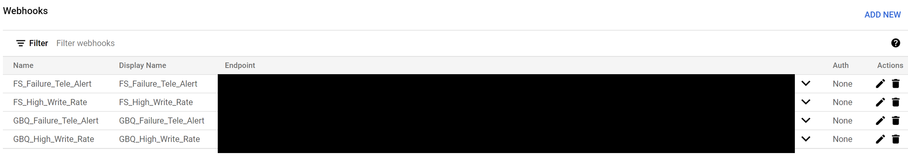
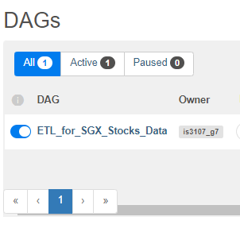

<!-- PROJECT LOGO -->

<div align="center">
  <a>
    
  </a>

  <h3 align="center">SFYR</h3>

  <p align="center">
    Investing Intelligence
    <br />
    <a href="https://github.com/edologgerbird/is3107_g7/blob/main/README.md"><strong>View the Full Project Report »</strong></a>
    <br />
    <a href="https://github.com/edologgerbird/is3107_g7/blob/main/README.md"><strong>View the Project Video Demonstration »</strong></a>
    <br />
    <a href="https://github.com/edologgerbird/is3107_g7/blob/main/README.md"><strong>View the Project API Documentation »</strong></a>
    <br />
  </p>
</div>

<!-- TABLE OF CONTENTS -->

### Table of Contents

<ol>
<li><a href="#authors">Authors</a></li>
<li><a href="#codes-and-resources-used">Codes and Resources Used</a></li>
<li><a href="#getting-started">Getting Started</a></li>
<li><a href="#usage">Usage</a></li>
<li><a href="#contact">Contact</a></li>
<li><a href="#acknowledgements">Acknowledgements</a></li>
</ol>

<br />

# SFYR Data Pipeline Implementation

Our Company, Sfyr (pronounced: Sapphire /sæfaɪə(r)/) aims to provide retail investors with the tools and data required to support their high-frequency retail trading decisions and needs. Through the use of a data warehouse, Apache Airflow and public data sources, Sfyr provides its clients with accurate, consolidated and updated stock data.

### _Keywords:_

_Data Pipeline, Data Engineering, Data Architecture, Data Warehouse, Scheduler, DAG, Apache Airflow, BigQuery, Firestore, Google Cloud Monitoring, Hugging Face, FinBERT, Sentiment, Natural Language Processing, Stocks Analysis, Investment Insights, Web Scraping, Data Visualisation, Time Series Data_

## Authors:

- Loh Hong Tak Edmund (A0XXX943H)
- Ng Ting You (A0XXX672N)
- Tan Yi Bing (A0XXX181U)
- Wong Zhou Wai (A0XXX509R)
- Yap Hui Yi (A0XXX707M)

<p align="right">(<a href="#top">back to top</a>)</p>

## Codes and Resources Used

**Python Version:** 3.9.5

**Built with:** [Microsoft Visual Studio Code](https://code.visualstudio.com/),
[Oracle VM Virtual Box](https://www.virtualbox.org/), [Git](https://git-scm.com/), [Apache Airflow](https://airflow.apache.org/)

**Notable Packages:** apache-airflow, beautifulsoup4, datetime, firebase-admin, json, numpy, pandas, pandas-gbq, telethon, pandas, parse, pendulum, regex, tokenizers, torch, transformers, virtualenv, yahoo-fin, yfinance (view requirements.txt for full list)

<p align="right">(<a href="#top">back to top</a>)</p>

## Getting Started

### **Prerequisites**

Make sure you have installed all of the following on your development machine:

- Python 3.8 onwards
- Linux Virtual Machine (Highly recommended for running Airflow). Pipeline tested on Oracle VM Virtual Box

<p align="right">(<a href="#top">back to top</a>)</p>

## **Installation**

We recommend setting up a virtual machine and virtual environment to run this project.


### _1. Oracle Virtual Machine_

To set up a VM Virtual Box, please follow the steps detailed [here](https://github.com/edologgerbird/is3107_g7/blob/test/edo-DAG/installation_guide/VM%20Installation%20Instructions.pdf).

### _2. Python Virtual Environment_

> ⚠️ **This step should be run within the Linux Virtual Machine**

Installing and Creation of a Virtual Environment

```sh
pip install virtualenv
virtualenv <your_env_name>
source <your_env_name>/bin/active
```

The requirements.txt file contains Python libraries that your notebooks depend on, and they will be installed using:

```sh
pip install -r requirements.txt
```

<p align="right">(<a href="#top">back to top</a>)</p>

### _3. Setting Up Airflow_

> ⚠️ **This step should be run within the Linux Virtual Machine**

Install Airflow in your Virtual Machine and Virtual Environment

```sh
export AIRFLOW_HOME=~/airflow

AIRFLOW_VERSION=2.2.3
PYTHON_VERSION="$(python --version | cut -d " " -f 2 | cut -d "." -f 1-2)"

CONSTRAINT_URL="https://raw.githubusercontent.com/apache/airflow/constraints-${AIRFLOW_VERSION}/constraints-${PYTHON_VERSION}.txt"

pip install "apache-airflow==${AIRFLOW_VERSION}" --constraint "${CONSTRAINT_URL}"
```

Create Airflow Admin Account using the following commands in Shell:

```sh
airflow db init
airflow users create \
--username <USERNAME> \
--firstname <YOUR NAME> \
--lastname <YOUR NAME> \
--role Admin \
--email <YOUR EMAIL>
```

### _4. Editing Airflow Configs_

Edit the airflow.cfg config file _(located in the airflow directory)_ with the following rules:

> 💡 **A sample airflow.cfg file is located in the utils folder**

```python
dags_folder = /home/airflow/is3107_g7

enable_xcom_pickling = True

dagbag_import_timeout = 100    #Prevents timeout when downloading FinBERT

load_examples = False    # OPTIONAL: Skips loading of DAG Examples
```

<p align="right">(<a href="#top">back to top</a>)</p>

### _5. Setting Up Databases Access and Error Email Alerts_

**Creating Google Service Account**

This data pipeline makes use of Google Cloud Suite of products our data warehouse. To enable the data pipeline to interface with BigQuery Database and Firestore Database, we will have to create Service Accounts with localised access to BigQuery and Firestore.

<br>

> ❗ **Keep your JSON Key Files Safe!** > <br>

<ol>
  <li> Create a project on Google Cloud Platform using an existing Google Account </li>
  <li> Head to <a href="https://console.cloud.google.com/iam-admin/iam" target="_blank"> IAM & Admin </a> </li>
  <li> Create a BigQuery Service Account with the following permissions and download JSON Key File
    <ul>
      <li> BigQuery Data Owner </li>
      <li> BigQuery Job User </li>
    </ul>
  </li>
  <li> Create a FireScore Service Account with the following permissions and download JSON Key File
    <ul>
      <li> 	Firebase Service Management Service Agent </li>
    </ul>
  </li>
</ol>

<br>

**Update Crediential JSON Key Files**

> ❗ **Keep your JSON Key Files Safe!**

Place the Google Authentication Crediential JSON Key files in `utils/` .

Update `utils/serviceAccount.json` with the name of the credential files.

<br>

**Set-up Airflow Email Alerts**

The current implementation of Airflow Email Alerts uses Gmail SMTP Service through an Gmail Account.

> ❗ **Keep your SMTP Password Safe!**

1. Generate your Gmail SMTP Password [here](https://support.google.com/mail/answer/185833?hl=)
2. Edit the `airflow.cfg` file (located in the airflow directory) with the following information:

```python
# Assumes the usage of Gmail as SMTP Server

smtp_host = smtp.gmail.com
smtp_starttls = True
smtp_ssl = False
smtp_user = <Email Address>
smtp_password = <SMTP Password>
smtp_port = 587
smtp_mail_from = <Email Address>
smtp_timeout = 30
smtp_retry_limit = 5
```

If you are not using Gmail as your SMTP Service, edit the information according to your SMTP Server Configurations.

3. Update the default_args in your DAG file. This will set-up the DAG to trigger an email if a task retries or fails. 

```python
default_args = {
    'email': [<Email Address>],
    'email_on_failure': True, 
    'email_on_retry': True,
}
```
4. Optional - Set-up the number of retries for a failed task and duration between retries

```python
default_args = {
    'retries': 1,
    'retry_delay': timedelta(minutes=1)
}
```

<p align="right">(<a href="#top">back to top</a>)</p>

### _6. Setting Up Google Cloud Telegram Alerts_

Before setting up the alerts on Google Cloud Monitoring, users will have to set-up a Telegram bot and enable the sending of messages from the bot to the relevant channels.

> ❗ **Keep your API Key Files Safe!**

1. Start a new conversation with the [Botfather](https://telegram.me/botfather).
2. Send /newbot to create a new Telegram bot.
3. When asked, enter a name for the bot.
4. Give the Telegram bot a unique username. Note that the bot name must end with the word "bot" (case-insensitive).
5. Copy and save the Telegram bot's access token for later steps.
6. Add the bot to your alert channel and enable access to send messages

After this is completed, we will have to set-up a new Alert Webhooks on [Google Cloud Monitoring](https://console.cloud.google.com/monitoring/alerting/notifications).



The webhook should utilise the Telegram WebHook API and you can define custom Notification Messages by editing the `message_encoded_in_http` field

> 💡 **You should test connection for errors before using it for alerts**

```http
https://api.telegram.org/bot<api_key>/sendMessage?chat_id=<chat_id>text=<message_encoded_in_http>
```

After setting up the alert channels, you can create monitoring policies to suit your needs. Below are some alerts recommended by the Sfyr team.

1. Firebase High Error

```
# Log Query
resource.type="firebase_domain" severity=ERROR
```

2. Firestore High Error - Needs to be enabled through the Firestore dashboard
3. BigQuery High Error

```
# Log Query
resource.type="bigquery_project" resource.labels.project_id="is3107-group-7" severity=ERROR

# Notification Rate Limit
One notification per 10 minutes

# Incident autoclose duration
30 minutes
```

<br>

<p align="right">(<a href="#top">back to top</a>)</p>

### _7. Setting Up Telegram Scraper Credentials_

Before being able to run the Telegram Scraper Module, user will have to register on Telegram and sign into their account via [Telegram Login](https://my.telegram.org/auth)

From there, access the API development tools, create a new project and note down your App

- api_id
- api_hash

<br>

> ❗ **Keep your API id and hash Safe!**

After getting the api_id and api_hash, update `utils/serviceAccount.json` telegramConfig object with your teleNumber, api_id and api_hash.

```json
{
  "telegramConfig": {
    "teleNumber": "<Phone_Number>",
    "api_id": ,
    "api_hash": "<API_HASH>"
  },
}
```

On first start up of the telegram scraping module, you will asked to enter a code sent to your telegram number as specified in the `utils/serviceAccount.json`. If you have an additional 2FA password set, you will be require to enter your password as well.

After the first setup and login, the telegram scraper module should work as intended.

<br>

<p align="right">(<a href="#top">back to top</a>)</p>

### _8. Setting Up of `ServiceAccount.json`_

With the Google Cloud Project Created in **Step 5**, we will have to update `ServiceAccount.json` which provides a centralised and local copy of the configurations, datasets and datatables.

```json
{
  "bigQueryConfig": {
    "PROJECT_ID": "<Google Cloud projectID>"
  }
}
```

<br>

<p align="right">(<a href="#top">back to top</a>)</p>

## Usage

### _1. Initialising Airflow Instance_

Initialise Airflow in your Virtual Machine via the following commands:

```sh
airflow scheduler -D
airflow webserver -D
```

By default, Airflow should be hosted on [http://localhost:8080](http://localhost:8080).
Both processes are running as Daemon Processes. Alternatively, users can set-up Systemd by following [this guide](https://airflow.apache.org/docs/apache-airflow/stable/howto/run-with-systemd.html).

### _2. Activating DAG Task_

After logging in, you will be brought to the main Airflow dashboard. To enable the DAG Task to run as per schedule, simply toggle the switch next to the task.



By default, the DAG is scheduled to execute twice a day, at 0930HRS and 2130HRS (GMT+8)

<p align="right">(<a href="#top">back to top</a>)</p>

## Contact

If you would like to reqeuest a feature or report a bug, please contact us at is3107.g7@gmail.com.

<p align="right">(<a href="#top">back to top</a>)</p>

## Acknowledgements

We would like to thank Assistant Professor Frank Xing, Dr Gao Yu Ting and Mr Quek Jian Hong Joel of the National University of Singapore for the opportunity to embark on this project.

We would also like to thank Nescafe and Redbull for providing us with the caffeine required to complete this project. We would also like to provide great thanks to the sitcom The Office for the inspirational words _"Why say lot word, when few word do trick"_.
